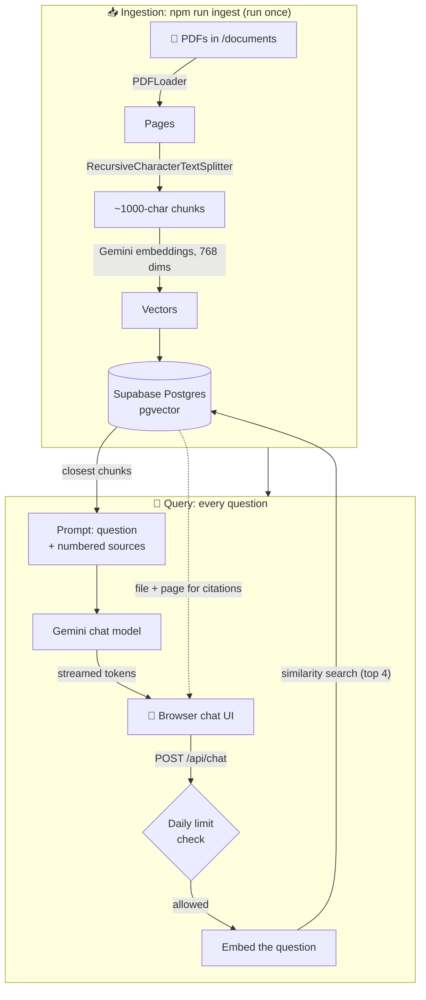

# Docs Chat

Chat with your documents. Ask a question, get an answer **grounded in your PDFs, with the sources cited**.

A Retrieval-Augmented Generation (RAG) app built with Next.js, LangChain JS, Supabase pgvector and Google Gemini. The demo knowledge base is a set of open-access AI research papers (RAG, Attention, LoRA, ReAct, ...).

**Live demo:** _coming soon_

## Features

- **Answers grounded in your documents.** If the documents don't contain the answer, it says so instead of guessing.
- **Source citations.** Every answer links to the file and page it came from, and you can expand the exact passage.
- **Streaming responses.** Sources appear first, then the answer streams in word by word.
- **Multi-document search.** One knowledge base across many PDFs.
- **Public-demo safety.** Per-visitor and global daily limits so a shared link can't drain the API quota.

## How it works



**Ingestion** happens once: each PDF is split into overlapping chunks, each chunk is turned into a vector (a list of numbers capturing its meaning), and the vectors are stored in Postgres with the `pgvector` extension.

**Querying** happens per question: the question is embedded the same way, Postgres finds the 4 closest chunks, and only those chunks are sent to the LLM, numbered `[1]`..`[4]`. The model is instructed to answer only from them and cite the numbers, which the UI turns into clickable source chips.

## Tech stack

| Layer | Choice |
|---|---|
| Framework | Next.js 16 (App Router, TypeScript), Tailwind CSS |
| RAG orchestration | LangChain JS |
| Vector store | Supabase Postgres + pgvector (HNSW index, cosine distance) |
| Embeddings | Google `gemini-embedding-001` (768 dimensions) |
| Chat model | Google Gemini (`gemini-flash-latest`, low thinking level for speed) |
| Hosting | Vercel |

The chat model is chosen in one function (`getChatModel()` in `src/lib/rag.ts`), so swapping providers is a one-file change.

## Project structure

```
src/
  app/page.tsx            Chat UI (streaming, citation chips, sources panel)
  app/api/chat/route.ts   Streaming API: validate -> rate limit -> retrieve -> generate
  lib/vectorstore.ts      Supabase client + Gemini embeddings (the vector store lives here)
  lib/rag.ts              Retrieval, prompt building, chat model
  lib/ratelimit.ts        Per-visitor + global daily limits
scripts/
  download-samples.ts     Fetches the demo PDFs from arXiv
  ingest.ts               PDFs -> chunks -> embeddings -> Supabase
  ask.ts                  Ask a question from the terminal
supabase/
  schema.sql              documents table, pgvector index, match_documents()
  rate_limit.sql          usage counters for the public demo
```

## Run it locally

**1. Install**
```bash
npm install
```

**2. Create a Supabase project** (free) at [supabase.com](https://supabase.com), then in **SQL Editor** run, in order:
- `supabase/schema.sql`
- `supabase/rate_limit.sql`

**3. Add your keys.** Copy `.env.example` to `.env.local` and fill it in:
- `GOOGLE_API_KEY`: free key from [aistudio.google.com/apikey](https://aistudio.google.com/apikey)
- `SUPABASE_URL`: your project URL (`https://<ref>.supabase.co`)
- `SUPABASE_SERVICE_ROLE_KEY`: the **secret** key (`sb_secret_...`) from Project Settings -> API Keys. This key bypasses row-level security, so it must stay server-side. Never use the publishable key here and never expose this one to the browser.

**4. Add documents and ingest them**
```bash
npm run download-samples   # demo AI papers into ./documents (or drop in your own PDFs)
npm run ingest             # chunk, embed, store
```

**5. Start the app**
```bash
npm run dev                # http://localhost:3000
```

Or ask from the terminal: `npm run ask -- "What is retrieval-augmented generation?"`

## Design notes

- **Free-tier pacing.** The free Gemini tier throttles quietly: past its per-minute limit it returns *empty vectors* instead of an error, which Postgres then rejects. `ingest.ts` validates every vector before storing it, retries with backoff, and paces itself (~1 chunk/second). Set `MS_PER_CHUNK = 0` on a paid key.
- **Embedding dimensions.** pgvector's HNSW index supports up to 2,000 dimensions, but Gemini defaults to 3,072, so embeddings are requested at 768. Changing the embedding model later means re-ingesting everything.
- **Thinking level.** The default Gemini "flash" alias reasons silently before answering, which made responses take 25+ seconds. Answering from supplied passages doesn't need that, so thinking is set to LOW (~3 seconds).
- **Fail-closed rate limiting.** Daily counters live in Postgres (serverless instances don't share memory). If the counter can't be read, requests are refused rather than left unmetered. Visitors are identified by a salted hash of their IP; raw IPs are never stored.
- **Re-ingesting is safe.** `ingest.ts` replaces a file's old chunks instead of duplicating them.

## Limitations

- **RAG finds passages; it doesn't do arithmetic over a dataset.** "What's the total of all invoices in March?" needs many chunks added up, but only the top 4 are retrieved. Questions like that belong in SQL or a calculation step.
- **Scanned PDFs** (images of text) need OCR, which isn't included.
- **Duplicate files** in the folder are stored twice and can produce duplicate citations.
- The demo runs on free tiers: Gemini has rate limits, and a free Supabase project pauses after a week of inactivity (restore it from the dashboard).

## Deploying to Vercel

1. Push this repo to GitHub and import it in Vercel.
2. Add the environment variables from `.env.example` in **Project Settings -> Environment Variables**.
3. Deploy. Ingest your documents from your own machine (`npm run ingest`); the deployed app only reads from Supabase.

> Only ingest documents you are comfortable sharing publicly if the demo is public: anyone can ask questions about them.
